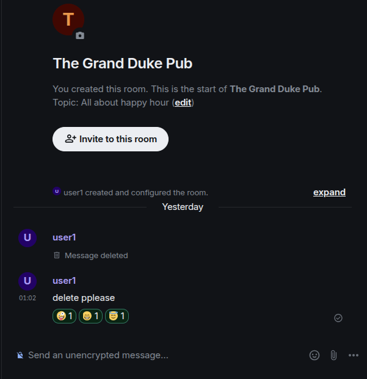

I am reading example of sending msgs:
```
"2026-02-08T09:02:09.310Z": {
    "method": "PUT",
    "url": "http://localhost:8008/_matrix/client/v3/rooms/!AOaLmLFXUOIwuCDMJd%3Alocalhost/send/m.room.message/m1770541329288.4",
    "payload": {
      "msgtype": "m.text",
      "body": "delete pplease ",
      "m.mentions": {}
    },
    "response": {
      "status": 200,
      "statusText": "OK",
      "body": {
        "event_id": "$jze-n6g469reZzarAuLF-kQPfgNSMynuDX9otPLe6KI"
      }
    }
  }
```

Visually, this is:



in full-synapse-api.json, this is the api: `/_matrix/client/v3/rooms/{roomId}/send/{eventType}/{txnId}`. However, it seems like the way it sends a simple message is quite complicated, it needs txnId, which is uniquely generated by CLIENT. 

This prompts me to think of an algo: